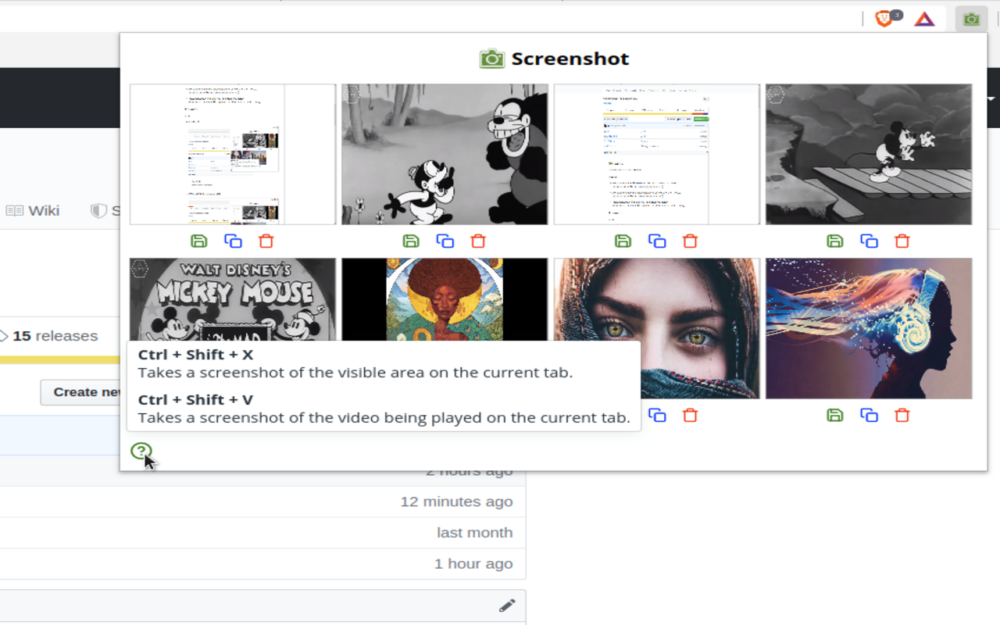
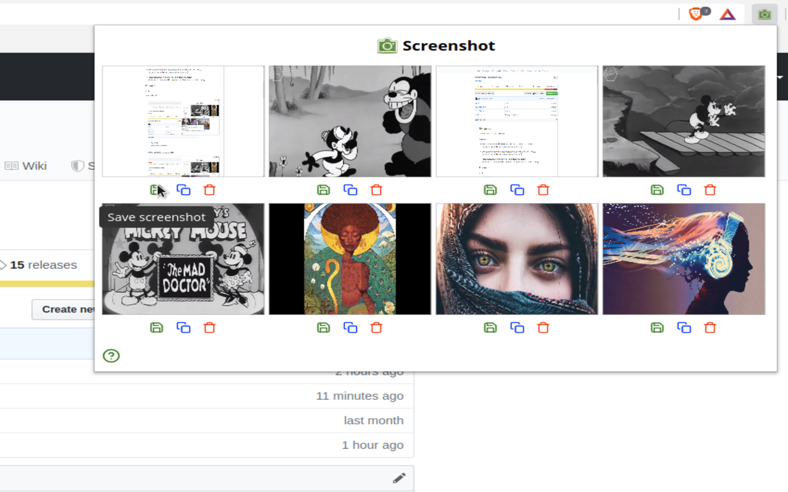
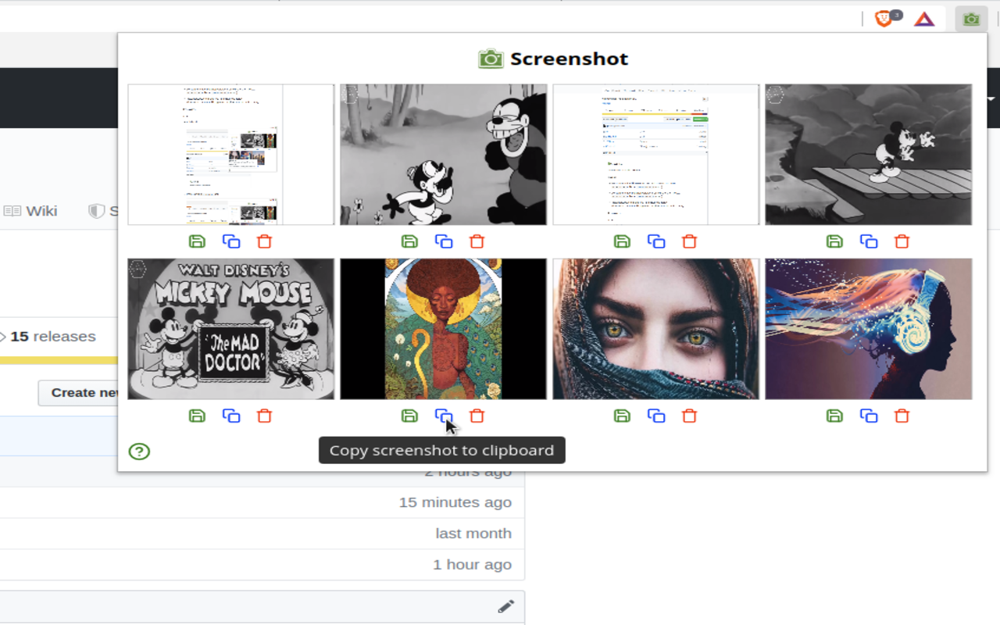
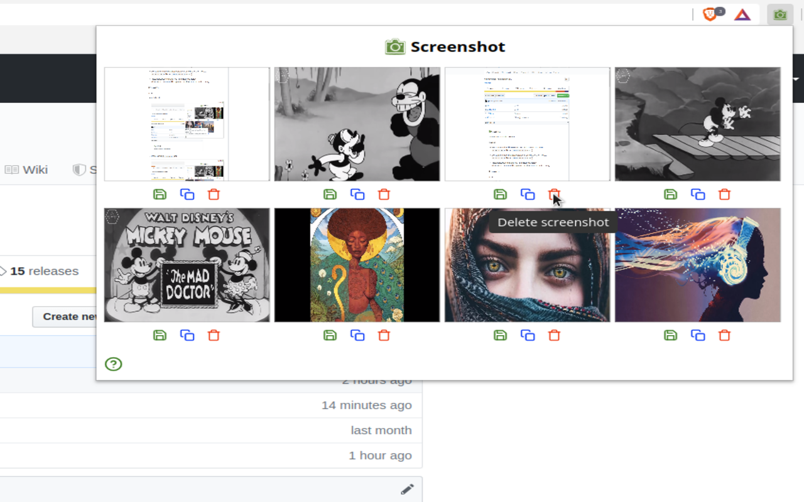

###  Screenshot

A browser extension that takes screenshots.

### Features

* Takes a screenshot of the visible area on the current tab in response to
  a key stroke  
  (`Ctrl + Shift + X` on PCs and  `Command + Shift + X` on Macs).

* Takes a screenshot of the video being played on the current tab in response to
  a key stroke  
  (`Ctrl + Shift + V` on PCs and  `Command + Shift + V` on Macs).

* Stores and previews the last 8 screenshots in temporary browser memory  
  (With the option to save them to disk, copy them to the clipboard and delete
   them from memory)

### Screenshots

#### v0.6.0

* Displaying help.

  

* Hovering over the `Save screenshot` icon.

  

* Hovering over the `Copy screenshot to clipboard` icon.

  

* Hovering over the `Delete screenshot` icon.

  

#### Older screenshots

[Available in ./webstore-assets/](./webstore-assets/)

### Install

#### Web stores

* [Google Chrome webstore](https://chrome.google.com/webstore/detail/screenshot/ehmcpclingghgidajkpodncclbginiak)

* Firefox ... Coming soon.

#### From source

* Grab a copy of the extension:

      git clone https://github.com/rg-3/screenshot.js

* In your browser, open `chrome://extensions`.

* Enable the `Developer mode` checkbox.

* Click the `Load unpacked extension` button and point it at the `src/`
  directory in the cloned repository.

* Done!

### Credit

  * Special thanks and credit to
    [Double-J Design](http://www.iconarchive.com/artist/double-j-design.html)
    for providing the green camera icons.

### Similar projects

  * [Take webpage screenshots](https://chrome.google.com/webstore/detail/take-webpage-screenshots/mcbpblocgmgfnpjjppndjkmgjaogfceg)

### License

MIT license. See [./LICENSE.txt](./LICENSE.txt) for details.

### ChangeLog

__v0.7.0__

* Change the tool tip on the `Delete` icon from "Delete screenshot" to
  "Delete screenshot from memory".

__v0.6.0__

* Store and preview up to 8 screenshots instead of 6.

__v0.5.2__

* Fix cross origin audio.

__v0.5.1__

* Update `background.js` to push onto `headers` instead of
 `details.responseHeaders` (typo fix).

__v0.5.0__

* Improve the display of notifications.  
  (By switching to generated notification IDs)

* On the Brave browser, when a screenshot of a video can't be captured because
  Brave is blocking all possible device recognition attempts or all possible
  cross-origin device recognition attempts, the extension will notify the user
  that's why a screenshot can't be captured.  

* Add support for taking a screenshot of a playing video loaded through an
  iframe.

*  Add support for taking a screenshot of a playing video on websites like `dailymail.co.uk`.
   The daily mail website loads video from another origin without setting the
   `Access-Control-Allow-Origin` header. It must be set to `*` or the video
   won't play because `crossorigin="anonymous"` has been set by
   `src/js/content-scripts/set-cross-origin.js`, which was introduced for Instagram support.

* Add support for taking a screenshot of a playing video on sites like Instagram.
  Instagram delivers video through another origin using CORS access controls,
  which require some extra work to support.
  (This change should see better support for other sites who work in a similar way
   as well.)

__v0.4.0__

* Remove horizontal scrollbar from screenshots of the visible tab.

* Restore the quality of visible tab screenshots.  
  (Bad quality screenshots were introduced in v0.3.0)

__v0.3.1__

* Fix silly typo in last release.

__v0.3.0__

* Remove vertical scroll bar from screenshots of the visible tab.

* Display a failure message when a video screenshot is attempted on a
  protected page that extensions can't inject code into (eg `chrome://*` pages).
  Prior to this a user wouldn't get a response.

__v0.2.5__

* Give preference to videos that visible and playing over videos that are just
  playing.

__v0.2.4__

* Don't take screenshots of videos that are visible and paused  
  (A video must be either visible and playing, or just playing to be captured).

__v0.2.3__

* Skip videos the browser considers "tainted", as it does not allow them to be
  exported.

* Improve the experience on websites like Twitter where there can be multiple
  videos on a page. When this happens we choose the first video that is visible
  and/or playing or the first that is visible and paused.  Otherwise we alert the
  user we couldn't find a video. This logic also applies to pages with a single
  video.

__v0.2.2__

* In `browser_action.html`, load JavaScript at the end of the document to let
 the browser parse the HTML first.

__v0.2.1__

* Reduce (visual) size of screenshot previews.

* Add light border around screenshot previews.

* Fix bug where screenshot previews had the bottom part cut off.

* Fix bug where icon tooltips for screenshots 4 to 6 would have `top` placement
  instead of `bottom` placement.

__v0.2.0__

* Add a help icon that opens a popover with information about how to take
  screenshots.

* Remove arrow from tooltips and popovers.

* Change default `capture-visible-tab` shortcut from `Ctrl + Shift + K` to
  `Ctrl + Shift + X`.

* Add ability to take a screenshot of the video on the current tab.  
  (Works on YouTube, etc).

* Insert `Press <shortcut> to take a screenshot` text after reading what
  shortcut the `capture-visible-tab` keyboard command is bound to (it can be changed
  to a custom shortcut by the user via the `chrome://extensions/shortcuts` page)
