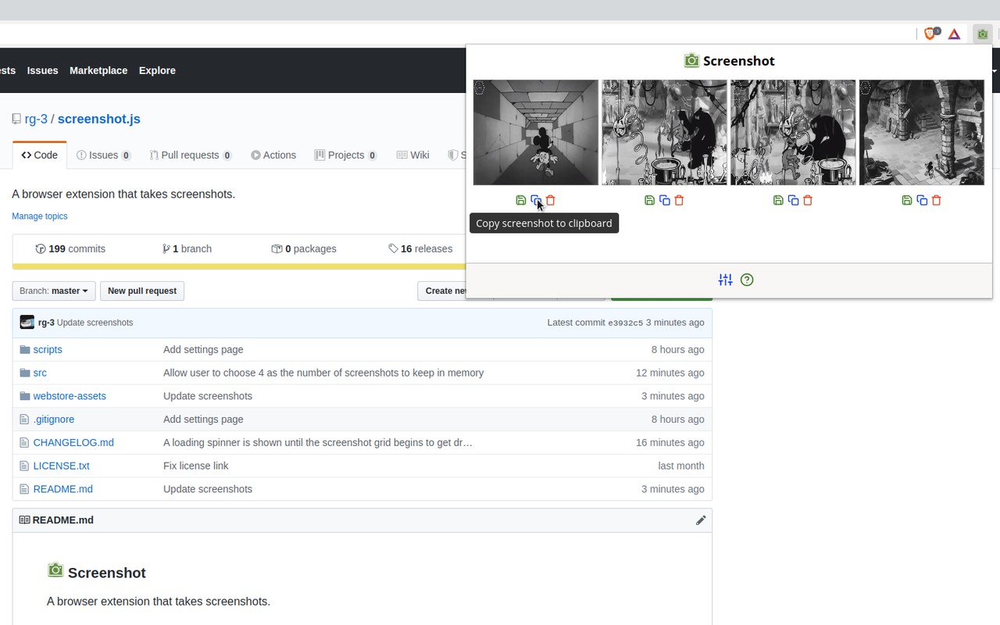
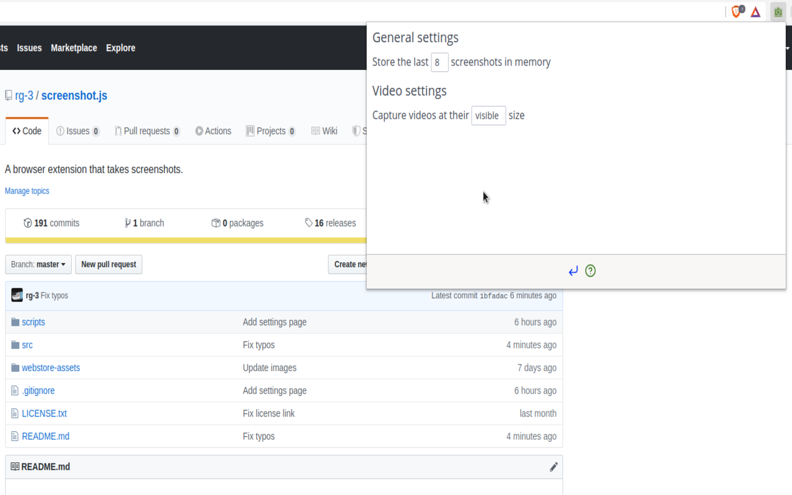
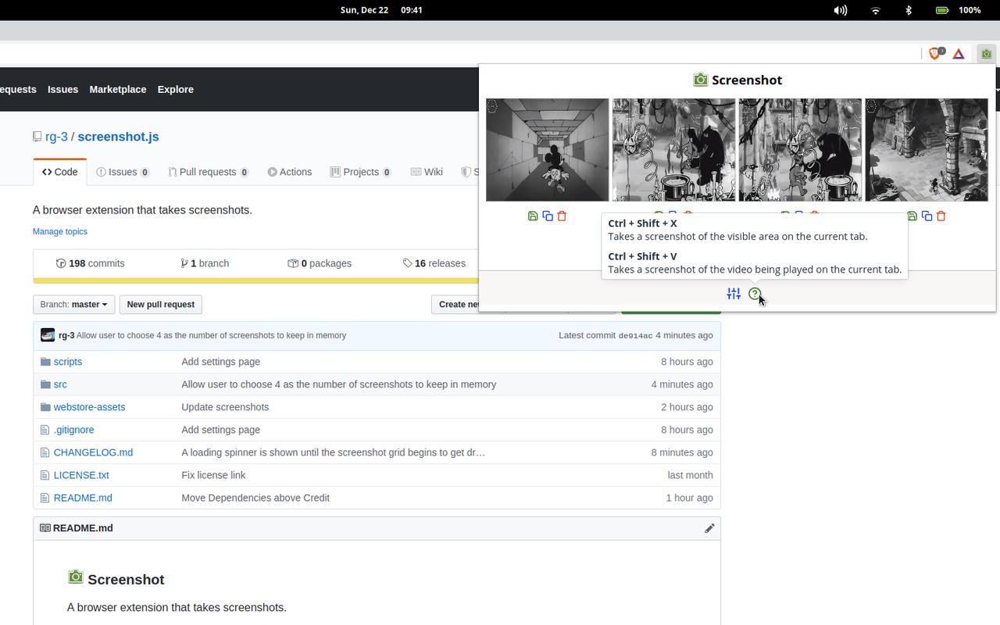

###  Screenshot

A browser extension that takes screenshots.

### Features

* Takes a screenshot of the visible area on the current tab in response to
  a key stroke  
  (`Ctrl + Shift + X` on PCs and  `Command + Shift + X` on Macs).

* Takes a screenshot of the video being played on the current tab in response to
  a key stroke  
  (`Ctrl + Shift + V` on PCs and  `Command + Shift + V` on Macs).

* Stores and previews the last 8 screenshots in temporary browser memory  
  (With the option to save them to disk, copy them to the clipboard and delete
   them from memory).

* Allows a user to select the number of screenshots stored in temporary browser memory.  
  (The default is 8).

* Allows a user to select between capturing videos at their natural size or at
  their visible size.   
  (The default is visible size)

### Screenshots

#### v0.8.0

* Default page, hovering over the `Copy to clipboard` icon.

  

* Settings page

  

* Showing help

  

#### Older screenshots

[Available in ./webstore-assets/](./webstore-assets/)

### Install

#### Web stores

* [Google Chrome webstore](https://chrome.google.com/webstore/detail/screenshot/ehmcpclingghgidajkpodncclbginiak)

* Firefox ... Coming soon.

#### From source

* Grab a copy of the extension:

      git clone https://github.com/rg-3/screenshot.js

* Convert the SCSS files to CSS  
  (This step requires the `scss` executable to be in `$PATH`):

      cd screenshot.js
      sh scripts/build.sh

* In your browser, open `chrome://extensions`.

* Enable the `Developer mode` checkbox.

* Click the `Load unpacked extension` button and point it at the `src/`
  directory in the cloned repository.

* Done!

### Credit

  * Thanks and credit to
    [Double-J Design](http://www.iconarchive.com/artist/double-j-design.html)
    for authoring the green camera icons.

### Dependencies

  * **Extension dependencies**

    An extension dependency is a dependency that's used while the extension
    is running.

    * Spectre.css  
      A minimalist CSS framework.

    * FeatherIcons  
      Provides icons

    * PopperJS, tippy.js  
      Provides popovers and tooltips

  * **Developer dependencies**

    A developer dependency is a dependency that's used to develop / build the
    extension.

      * SCSS  
        SCSS is a language that extends CSS with many useful features that make
        styling pages easier and more maintainable. It is trans-piled to CSS.

### License

MIT license. See [./LICENSE.txt](./LICENSE.txt) for details.

### ChangeLog

Available at [./CHANGELOG.md](./CHANGELOG.md)
