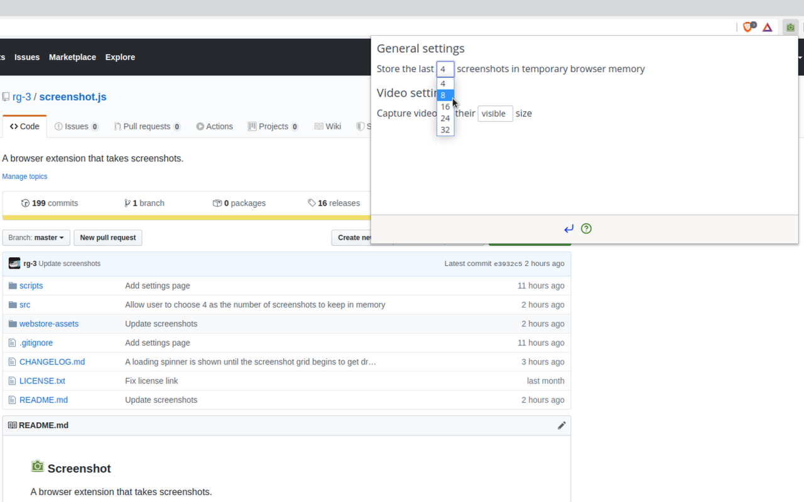

## Screenshot.js

A browser extension that takes screenshots.  
For the time being it works on Chromium-derived forks, with Firefox support
planned for the future.

## Features

With Screenshot.js, you can:

* Take a screenshot of the visible area on the current tab using a keyboard shortcut  
  (`Ctrl + Shift + X` on PCs and  `Command + Shift + X` on Macs).

* Take a screenshot of the video being played on the current tab using a keyboard shortcut  
  (`Ctrl + Shift + V` on PCs and  `Command + Shift + V` on Macs).

* Store screenshots in temporary browser memory.

* Open screenshots in a new tab, save them to disk, copy them to the clipboard  
  and delete them from temporary browser memory.

* Select the number of screenshots stored in temporary browser memory.  
  (Default is 4).

* Select between capturing videos at their natural size or at their visible size.   
  (Default is visible size)

## Screenshots

__v0.8.0__

* The view that previews screenshots, and lets you perform actions on them.  
  (Such as open, save, copy, and delete).

  

* The same view as previous, but with instructions on how to take screenshots
  visible.

  

* The settings view, with a drop down expanded.

  

__Older screenshots__

[Available in ./webstore-assets/](./webstore-assets/)

## Install

__Web stores__

* [Chrome Webstore](https://chrome.google.com/webstore/detail/screenshot/ehmcpclingghgidajkpodncclbginiak)

  __Version of Screenshot on the Chrome Webstore could be outdated__

  Screenshot gets flagged for manual review each time it's published on the
  Chrome Webstore. The manual review process is sometimes slow relative to the
  rate at which there are new versions of Screenshot.

  To give you an idea of how far behind Screenshot can be: at the time of writing
  the published version on the webstore is `v0.2.5` while the current version of
  Screenshot is `v0.7.0`, with `v0.8.0` almost complete.

  It's recommended to check how far behind the webstore version is before
  installing, and to consider installing from source if it's outdated. The
  current version of Screenshot can be seen on the [releases page](https://github.com/rg-3/screenshot.js/releases).

* Firefox ...

  Coming soon.

__From source__

* Grab a copy of the extension:

      git clone https://github.com/rg-3/screenshot.js

* Convert the SCSS files to CSS  
  (This step requires the `scss` executable to be in `$PATH`):

      cd screenshot.js
      sh scripts/build.sh

* In your browser, open `chrome://extensions`.

* Enable the `Developer mode` checkbox.

* Click the `Load unpacked extension` button and point it at the `src/`
  directory in the cloned repository.

* Done.

## Dependencies

__Runtime dependencies__

Dependencies used while the extension is running:

* Spectre.css  
  Minimalist CSS framework.

* Feather Icons  
  Provides icons.

* PopperJS, tippy.js  
  Provides popovers and tooltips.

__Development dependencies__

Dependencies used to develop the extension:

  * SCSS  
    SCSS is a language that extends CSS with useful features that make
    styling pages easier and more maintainable. It is transpiled to CSS.

## Credit

  * Thanks and credit to
    [Double-J Design](http://www.iconarchive.com/artist/double-j-design.html)
    for authoring the green camera icons.

## License

MIT license. See [./LICENSE.txt](./LICENSE.txt) for details.

## Changelog

[CHANGELOG.md](./CHANGELOG.md)
