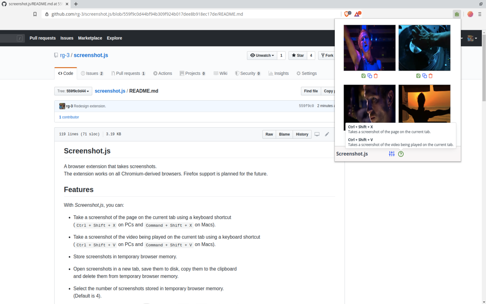
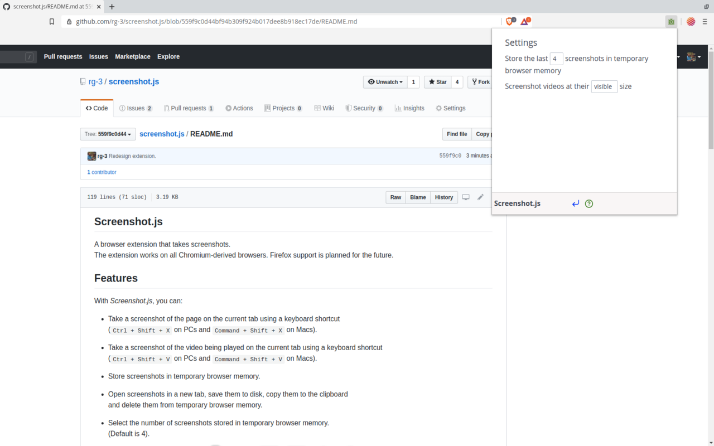

## Screenshot

**Table of contents**

* <a href="#introduction"> Introduction </a>
* <a href="#features"> Features </a>
* <a href='#screenshots'>Screenshots</a>
* <a href='#install'>Install</a>
  * <a href='#install-webstores'> Webstores </a>
  * <a href='#install-fromsource'> From source </a>
* <a href='#dependencies'>Dependencies</a>
* <a href='#credit'>Credit</a>
* <a href='#license'>License</a>

## <a id='introduction'>Introduction</a>

A browser extension that takes screenshots of web pages and web videos.  
The extension works on all Chromium-derived (eg Chrome) browsers.

## <a id='features'>Features</a>

* Take a screenshot of the page on the current tab using a keyboard shortcut  
  (`Ctrl + Shift + X` on PCs and  `Command + Shift + X` on Macs).

* Take a screenshot of the video being played on the current tab using a keyboard shortcut  
  (`Ctrl + Shift + V` on PCs and  `Command + Shift + V` on Macs).

* Open screenshots in a new tab, save screenshots to disk, and copy screenshots
  to the clipboard.

* Easy to use, respects your privacy.

## <a id='screenshots'>Screenshots</a>

**1.**

**2.**

## <a id='install'> Install </a>

<a id='install-webstores'>**Webstores**</a>

* [Chrome Webstore](https://chrome.google.com/webstore/detail/screenshot/ehmcpclingghgidajkpodncclbginiak)

<a id='install-fromsource'>**From source**</a>

* Clone a copy of the extension:

      git clone https://github.com/rg-3/screenshot.js

* Convert the SCSS files to CSS  
  (This step requires the `scss` executable to be in `$PATH`):

      cd screenshot.js
      sh scripts/build.sh

* Open `chrome://extensions` in your browser.

* Enable the `Developer mode` checkbox.

* Click the `Load unpacked extension` button and point it at the `src/`
  directory in the cloned repository.

* Done.

## <a id='dependencies'> Dependencies </a>

**Runtime dependencies**

Dependencies used while the extension is running:

* Spectre.css  
  Minimalist CSS framework.

* Feather Icons  
  Provides icons.

* PopperJS, tippy.js  
  Provides popovers and tooltips.

**Development dependencies**

Dependencies used to develop the extension:

  * SCSS  
    SCSS is a language that extends CSS with useful features that make
    styling pages easier and more maintainable. It is transpiled to CSS.

## <a id='credit'>Credit</a>

  * Thanks and credit to
    [Double-J Design](http://www.iconarchive.com/artist/double-j-design.html)
    for authoring the green camera icons.

## <a id='license'>License</a>

MIT license. See [./src/LICENSE.txt](./src/LICENSE.txt) for details.
