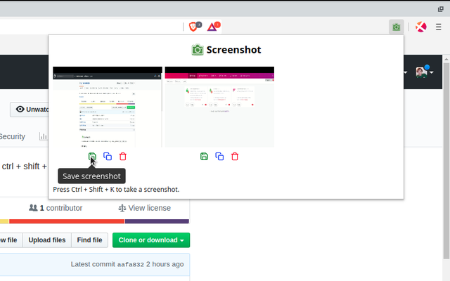
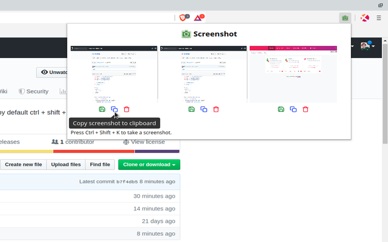
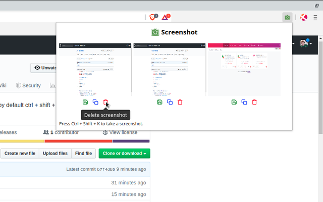

###  Screenshot

A browser extension that takes screenshots.

### Features

* Takes a screenshot of the visible area on the current tab in response to
  a key stroke (`Ctrl + Shift + k` or on Macs `Command + Shift + k`).

* Displays the six most recent screenshots by clicking on the extensions
  browser action (icon).

* Screenshots can be previewed, saved to disk, copied to the clipboard and
  deleted from temporary browser memory.

* Does not make network requests and stores screenshots in temporary browser
  memory (with the option to save them to disk or copy them to the clipboard).

### Screenshots

#### v0.1.0

* Hovering over the `Save screenshot` icon.

  

* Hovering over the `Copy screenshot to clipboard` icon.

  

* Hovering over the `Delete screenshot` icon.

  

### Install

#### Chrome webstore

Coming soon...

#### Source

* Grab a copy of the extension:

      git clone https://github.com/rg-3/screenshot.js

* In your browser, open `chrome://extensions`.

* Enable the `Developer mode` checkbox.

* Click the `Load unpacked extension` button and point it at the `src/`
  directory in the cloned repository.

* Done!

### Credit

  * Special thanks and credit to
    [Double-J Design](http://www.iconarchive.com/artist/double-j-design.html)
    for providing the green camera icon.

### Similar projects

  * [Take webpage screenshots](https://chrome.google.com/webstore/detail/take-webpage-screenshots/mcbpblocgmgfnpjjppndjkmgjaogfceg)

### License

MIT license. See [./LICENSE.txt](./LICENSE.txt) for details.
